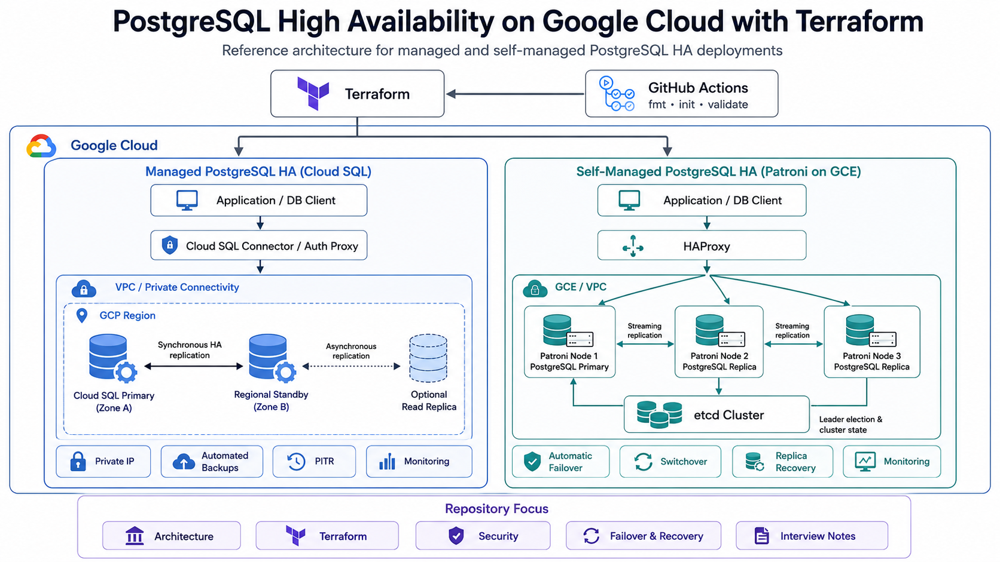
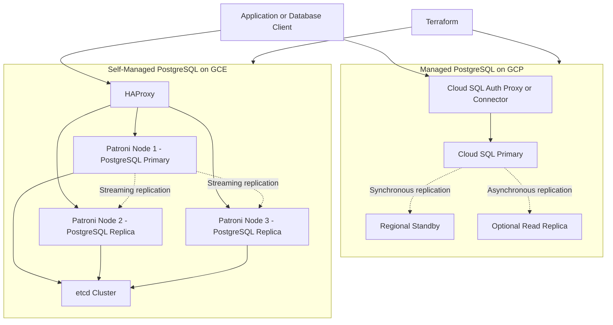

# PostgreSQL High Availability on Google Cloud with Terraform

Reference architecture and infrastructure-as-code implementation for highly available PostgreSQL platforms on Google Cloud.

The repository covers two PostgreSQL high-availability deployment models:

1. **Managed PostgreSQL HA** using Google Cloud SQL for PostgreSQL.
2. **Self-managed PostgreSQL HA** using Patroni, etcd, and HAProxy on Google Compute Engine.

The focus is on infrastructure design, Terraform configuration, PostgreSQL availability concepts, failover operations, security controls, backup and recovery, monitoring, and operational troubleshooting.

## Architecture Diagram

<p align="center">
  
</p>

The architecture compares two deployment models:

- **Managed PostgreSQL HA** using regional Cloud SQL, private connectivity, backups, PITR, monitoring, and optional read replicas.
- **Self-managed PostgreSQL HA** using Patroni, PostgreSQL streaming replication, etcd, HAProxy, and Compute Engine.

## Architecture Overview



## Technology Stack

- PostgreSQL
- Google Cloud SQL
- Google Compute Engine
- Terraform
- Patroni
- etcd
- HAProxy
- Google Cloud Monitoring
- GitHub Actions

## Repository Structure

```text
.
├── architecture/       Architecture decisions and deployment models
├── terraform/          Terraform configurations for GCP resources
├── configs/            PostgreSQL, Patroni, etcd, and HAProxy configurations
├── commands/           Operational and troubleshooting command references
├── docs/               HA, recovery, security, and interview concepts
└── .github/workflows/  Terraform validation workflows
```

## Deployment Models

### Cloud SQL for PostgreSQL

Google-managed PostgreSQL architecture providing regional high availability, automated backups, point-in-time recovery, maintenance management, and integration with GCP networking and IAM.

### Patroni on Compute Engine

Self-managed PostgreSQL architecture using Patroni for cluster management, etcd for distributed consensus, and HAProxy for primary and replica routing.
