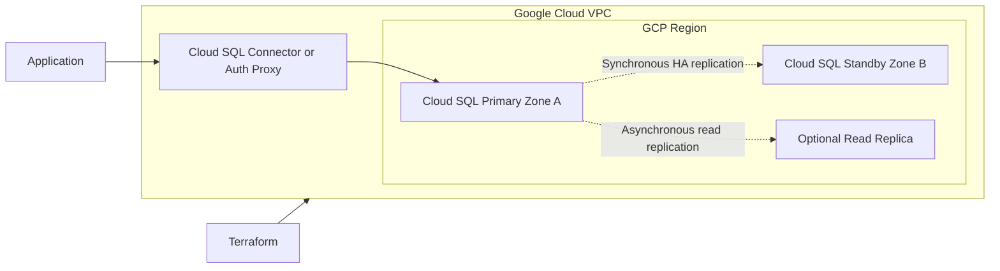

# Cloud SQL for PostgreSQL: High-Availability Architecture

## Overview

This architecture uses Google Cloud SQL for PostgreSQL as a managed regional high-availability database platform.

Google Cloud manages the underlying PostgreSQL infrastructure, operating system, replication, health detection, failover, maintenance, and instance recovery.

Terraform manages the infrastructure configuration as code.

## Architecture

## Core Components

### Cloud SQL Primary

The primary instance accepts:

- Read operations
- Write operations
- Schema modifications
- User and database administration

Applications connect to the primary using a Cloud SQL connector, Cloud SQL Auth Proxy, private IP, or another supported connection method.

### Standby Instance

The standby instance:

- Runs in a different zone within the same region
- Is managed automatically by Google Cloud
- Is not directly accessible by applications
- Receives synchronous storage-level replication
- Becomes the primary when failover occurs

The standby is designed for availability and is different from a read replica.

### Read Replica

A read replica is an optional, independently addressable PostgreSQL instance used for:

- Read scaling
- Reporting
- Analytics
- Reducing query load on the primary
- Cross-region disaster-recovery designs

Replication to a normal read replica is asynchronous.

A standard read replica does not automatically replace the primary during a failure.

## Regional High Availability

A regional Cloud SQL instance uses:

- One primary zone
- One secondary zone
- A primary database instance
- A standby database instance
- Synchronous replication across zonal persistent storage

A transaction is reported as committed only after its write has been replicated to storage in both zones.

This reduces the risk of losing committed transactions during a supported zonal failover.

## Failover Process

Failover can occur when:

- The primary instance becomes unavailable
- The primary zone experiences an outage
- The underlying infrastructure becomes unhealthy
- A manual failover is initiated for testing

During failover:

1. Cloud SQL detects that the primary is unhealthy.
2. The standby instance is promoted.
3. Existing database connections are closed.
4. The promoted standby starts serving traffic.
5. Applications reconnect using the same connection name or IP address.
6. The former primary is later recreated as the new standby.

Applications must implement:

- Connection timeouts
- Retry logic
- Connection-pool recovery
- Idempotent transaction handling where appropriate

## Failover and Failback

### Failover

Failover moves the primary database role to the standby zone.

### Failback

Failback moves the primary role back to the preferred or original zone.

Cloud SQL does not automatically move the primary back immediately after the failed zone recovers.

## Recovery Objectives

### Recovery Time Objective

The Recovery Time Objective, or RTO, defines how long the database service can remain unavailable.

Cloud SQL regional failover commonly causes a temporary interruption while existing connections are closed and clients reconnect.

Google documents approximately 60 seconds as an expected failover interruption, although the actual duration depends on the environment and workload.

### Recovery Point Objective

The Recovery Point Objective, or RPO, defines how much data loss is acceptable.

Because regional HA uses synchronous replication before acknowledging committed writes, committed transactions are designed to remain available after a supported zonal failover.

Transactions that were still in progress when the failure occurred can fail and must be retried by the application.

## High Availability Versus Read Replicas

| Capability | HA Standby | Read Replica |
|---|---|---|
| Primary purpose | Availability | Read scaling |
| Replication | Synchronous storage replication | PostgreSQL streaming replication |
| Application access | No direct access | Direct read access |
| Writable | Only after promotion | No |
| Automatic zonal failover | Yes | No |
| Separate connection endpoint | No | Yes |
| Cross-region deployment | No | Yes |
| Reporting workload | No | Yes |

High availability and read replicas solve different problems.

An HA standby protects against an instance or zonal failure. A read replica provides read capacity and can support a broader disaster-recovery strategy.

## Backup and Recovery

High availability does not replace backups.

The architecture should include:

- Automated backups
- Backup retention
- Point-in-time recovery
- Transaction-log retention
- Restore testing
- Protection against accidental deletion
- Recovery runbooks

Point-in-time recovery can restore a database to a selected timestamp by creating or restoring an instance from retained recovery data.

## Regional Disaster Recovery

Regional HA protects against failures within one region.

It does not by itself protect against complete regional loss.

A regional disaster-recovery design can include:

- Cross-region read replicas
- Replica promotion procedures
- DNS or application-routing changes
- Secret and configuration replication
- Tested recovery runbooks

Because normal read replication is asynchronous, cross-region recovery can have a non-zero RPO caused by replication lag.

## Security Controls

Recommended controls include:

- Private IP or Private Service Connect
- Cloud SQL Auth Proxy or language connectors
- IAM database authentication where appropriate
- TLS-encrypted connections
- Least-privilege service accounts
- Secret Manager for credentials
- Database-level role separation
- Audit logging
- Deletion protection
- Customer-managed encryption keys when required
- Restricted administrative access

## Terraform Responsibilities

Terraform can manage:

- Cloud SQL instance configuration
- Regional availability
- PostgreSQL version
- Machine tier
- Storage settings
- Backup configuration
- Point-in-time recovery
- Private networking
- Databases
- Database users
- IAM bindings
- Monitoring alerts
- Read replicas
- Deletion protection

Database schema migrations and application data should normally be managed separately from infrastructure provisioning.

## Important Interview Points

- Cloud SQL regional HA uses a primary and standby in different zones.
- The standby is not a read replica.
- HA protects against zonal failure; it does not provide regional disaster recovery.
- Read replicas provide read scaling and can support cross-region recovery.
- Existing connections are interrupted during failover.
- Applications must reconnect and retry safely.
- Synchronous HA replication reduces committed-data loss during zonal failover.
- Asynchronous read replicas can experience replication lag.
- Backups and PITR remain necessary even when HA is enabled.
- Terraform should protect critical databases using lifecycle and deletion-protection controls.

## Official References

- [Cloud SQL PostgreSQL high availability](https://docs.cloud.google.com/sql/docs/postgres/high-availability)
- [Configure Cloud SQL high availability](https://docs.cloud.google.com/sql/docs/postgres/configure-ha)
- [Cloud SQL PostgreSQL replication](https://docs.cloud.google.com/sql/docs/postgres/replication)
- [Cloud SQL point-in-time recovery](https://docs.cloud.google.com/sql/docs/postgres/backup-recovery/pitr)
