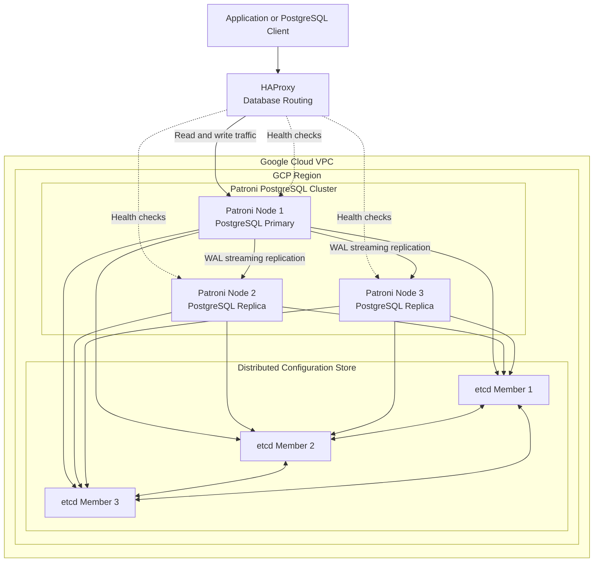

# PostgreSQL High Availability with Patroni on Google Compute Engine

## Overview

This architecture demonstrates a self-managed PostgreSQL high-availability platform running on Google Compute Engine.

The design uses:

- PostgreSQL for relational database services
- Patroni for PostgreSQL cluster orchestration
- etcd as the distributed configuration store
- HAProxy for database connection routing
- Terraform for Google Cloud infrastructure provisioning
- PostgreSQL streaming replication between database nodes

Unlike Cloud SQL, the operating system, PostgreSQL configuration, failover behavior, replication, patching, backup strategy, and cluster recovery remain the responsibility of the platform team.

## Architecture



## Core Components

### PostgreSQL

PostgreSQL stores application data and provides:

- SQL processing
- Transaction management
- Write-ahead logging
- Streaming replication
- Roles and permissions
- Backup and recovery capabilities

Only the current primary accepts normal write traffic.

Replica nodes continuously receive and replay WAL records generated by the primary.

### Patroni

Patroni runs alongside PostgreSQL on every database node.

Its responsibilities include:

- PostgreSQL process management
- Primary election
- Cluster membership
- Replication configuration
- Health reporting
- Automatic failover
- Controlled switchover
- Replica initialization
- PostgreSQL configuration management
- Interaction with the distributed configuration store

Patroni does not replace PostgreSQL replication. It coordinates PostgreSQL and manages which node is allowed to operate as the primary.

### etcd

etcd acts as the distributed configuration store, or DCS.

It stores information such as:

- Current cluster leader
- Cluster membership
- Patroni configuration
- Failover state
- Initialization state
- Leader lock and lease information

A three-member etcd cluster can tolerate the loss of one member while retaining quorum.

The database nodes do not use etcd to store application data. Application data remains inside PostgreSQL.

### HAProxy

HAProxy provides a stable connection endpoint for applications.

It uses Patroni REST API health checks to determine:

- Which node is the current primary
- Which nodes are healthy replicas
- Whether a node is ready to receive traffic

Typical routing endpoints include:

```text
5432 - PostgreSQL read/write endpoint
5433 - Optional read-only replica endpoint
7000 - Optional HAProxy statistics endpoint
```

Applications should connect to HAProxy instead of connecting directly to a specific PostgreSQL node.

## Request Flow

A normal write request follows this path:

```text
Application
    ↓
HAProxy
    ↓
Patroni health check
    ↓
Current PostgreSQL primary
    ↓
WAL records
    ↓
PostgreSQL replicas
```

HAProxy routes write traffic only to the node that Patroni reports as the primary.

If leadership changes, HAProxy health checks identify the newly promoted primary and begin routing new connections to it.

## Leader Election

Patroni uses a leader lock stored in etcd.

The current primary must periodically renew this lock.

A simplified election flow is:

1. Patroni nodes read the current cluster state from etcd.
2. One healthy node acquires the leader lock.
3. That node runs PostgreSQL as the primary.
4. The remaining nodes follow the primary as replicas.
5. The leader periodically renews its lease.
6. If the leader stops renewing the lease, the lock expires.
7. Eligible replicas compete to acquire leadership.
8. The winning replica promotes PostgreSQL to primary.

The distributed configuration store must have quorum before a new leader can be safely elected.

## Important Patroni Timing Parameters

Common Patroni control-loop parameters include:

### `ttl`

The maximum duration for which the leader lock remains valid without being renewed.

```yaml
ttl: 30
```

### `loop_wait`

The interval between Patroni control-loop executions.

```yaml
loop_wait: 10
```

### `retry_timeout`

The maximum time Patroni retries operations against the distributed configuration store before treating them as failed.

```yaml
retry_timeout: 10
```

These values affect failure-detection and failover timing.

They must be selected carefully because overly aggressive values can increase the risk of unnecessary failovers during temporary network interruptions.

A common safety relationship is:

```text
loop_wait + 2 × retry_timeout <= ttl
```

## PostgreSQL Streaming Replication

PostgreSQL replicas connect to the primary and continuously receive WAL records.

The replication process includes:

1. A transaction modifies data on the primary.
2. PostgreSQL records the change in WAL.
3. A WAL sender transmits records to replicas.
4. WAL receivers write the records locally.
5. Replica recovery processes replay the changes.
6. Replicas become consistent with the primary.

Important PostgreSQL processes and views include:

```text
WAL sender
WAL receiver
startup process
pg_stat_replication
pg_stat_wal_receiver
```

## Asynchronous Replication

With asynchronous replication, the primary can acknowledge a transaction before the replica confirms receipt.

Advantages:

- Lower write latency
- Better tolerance of slow replicas
- Suitable across higher-latency networks

Risks:

- Recent committed transactions can be lost if the primary fails before WAL reaches a replica
- Replication lag creates a non-zero recovery point objective

## Synchronous Replication

With synchronous replication, transaction acknowledgment waits for confirmation from one or more replicas.

Advantages:

- Reduced risk of committed-data loss
- Lower recovery point objective

Trade-offs:

- Increased transaction latency
- Writes can become unavailable when no synchronous replica is reachable
- Network performance directly affects database performance

Patroni can manage synchronous PostgreSQL settings and select eligible synchronous replicas.

## Failover

Failover is an unplanned leadership change caused by a failure.

Example:

```text
Primary becomes unavailable
        ↓
Leader lock expires
        ↓
Patroni evaluates healthy replicas
        ↓
Most suitable replica acquires leadership
        ↓
Replica is promoted
        ↓
HAProxy detects the new primary
        ↓
Applications reconnect
```

Potential failover triggers include:

- PostgreSQL process failure
- Compute Engine instance failure
- Operating-system failure
- Primary-zone failure
- Loss of communication between Patroni and PostgreSQL
- Loss of the current leader lock

## Switchover

Switchover is a planned leadership change.

It is commonly used for:

- Maintenance
- Operating-system patching
- PostgreSQL upgrades
- Infrastructure changes
- Failover testing
- Moving leadership to a preferred node

A switchover normally specifies:

- Current leader
- Candidate replica
- Scheduled or immediate execution
- Maximum expected replication lag

Unlike failover, switchover occurs while the existing primary is still healthy.

## Failover Versus Switchover

| Capability | Failover | Switchover |
|---|---|---|
| Trigger | Unexpected failure | Planned operation |
| Current primary healthy | Usually no | Yes |
| Candidate selection | Automatic or manual | Controlled |
| Main purpose | Restore availability | Maintenance or testing |
| Data-loss risk | Depends on replication mode and lag | Normally minimized |
| Operational planning | Reactive | Proactive |

## Replica Selection

Patroni can consider several conditions before promoting a replica:

- Replica health
- Replication lag
- Timeline compatibility
- Node tags
- Whether promotion is explicitly disabled
- Watchdog state
- Cluster configuration
- Accessibility of the distributed configuration store

A node can be prevented from becoming primary using tags such as:

```yaml
tags:
  nofailover: true
```

Other useful tags can control:

- Load-balancer participation
- Synchronous-replica eligibility
- Clone-source eligibility

## Split-Brain Prevention

Split brain occurs when more than one PostgreSQL node incorrectly operates as primary.

The architecture reduces this risk through:

- A single leader lock in etcd
- Quorum-based distributed consensus
- Patroni control-loop checks
- PostgreSQL timeline validation
- Optional watchdog fencing
- Restricted direct database access
- HAProxy routing based on Patroni health
- Careful network-partition handling

A node that cannot safely confirm leadership should not continue accepting writes indefinitely.

## etcd Quorum

A three-member etcd cluster requires two members for quorum.

| Available members | Quorum available | New leader election |
|---:|---|---|
| 3 of 3 | Yes | Yes |
| 2 of 3 | Yes | Yes |
| 1 of 3 | No | No |
| 0 of 3 | No | No |

When etcd loses quorum:

- The current PostgreSQL primary may continue operating temporarily depending on its valid leader lease.
- Patroni cannot safely elect a new leader.
- Automatic failover is unavailable.
- Restoring etcd quorum becomes the priority.

Adding more etcd members does not always improve availability. Odd-numbered clusters are generally preferred because quorum is based on a majority.

## HAProxy Health Checks

Patroni exposes REST API endpoints that HAProxy can query.

Typical logical checks include:

```text
/primary
/replica
/health
/readiness
/liveness
```

A read/write backend should include only the node currently reported as primary.

A read-only backend can include healthy replica nodes.

Health checks should test Patroni state rather than only checking whether TCP port `5432` is open. A replica can have PostgreSQL running while still being unsuitable for write traffic.

## Connection Handling During Failover

Existing PostgreSQL connections to the old primary are normally interrupted.

Applications should implement:

- Connection timeouts
- Retry with backoff
- Connection-pool health checks
- Pool eviction for failed connections
- Transaction retry where safe
- Idempotency for retryable operations

HAProxy provides endpoint continuity, but it cannot preserve an existing PostgreSQL session after the database node fails.

## Backup and Recovery

High availability does not replace backups.

Recommended capabilities include:

- PostgreSQL base backups
- Continuous WAL archiving
- Point-in-time recovery
- Backup encryption
- Off-host backup storage
- Cross-region backup copies
- Retention policies
- Restore validation
- Recovery runbooks

Possible PostgreSQL backup tools include:

- `pg_basebackup`
- pgBackRest
- Barman
- WAL-G

A backup should not be considered reliable until restoration has been tested.

## Monitoring

Important PostgreSQL metrics include:

- Database availability
- Active connections
- Transaction rate
- Query latency
- Replication lag
- WAL generation rate
- Checkpoint duration
- Cache-hit ratio
- Lock contention
- Deadlocks
- Disk utilization
- Disk IOPS
- Autovacuum activity

Important Patroni and etcd metrics include:

- Current leader
- Member health
- Leader changes
- DCS request latency
- etcd quorum health
- Leader-lock renewal failures
- Replica promotion events
- PostgreSQL restart events

Useful alert conditions include:

- No Patroni leader
- Multiple nodes reporting primary state
- Replica lag above threshold
- etcd quorum loss
- HAProxy backend unavailable
- Disk space below threshold
- PostgreSQL connections near limit
- Backup or WAL archive failure

## Security Controls

Recommended controls include:

- Private Compute Engine instances
- No public PostgreSQL exposure
- Firewall rules restricted by source and port
- TLS for PostgreSQL client connections
- TLS for replication connections
- TLS authentication for etcd
- Strong PostgreSQL authentication
- Least-privilege service accounts
- Secret Manager or Vault for credentials
- Encrypted persistent disks
- OS Login or identity-aware administrative access
- Restricted Patroni REST API access
- Audit logging
- Regular patching
- Backup encryption

Secrets should not be committed to Git or stored directly in Terraform state when avoidable.

## Failure Scenarios to Test

A complete validation plan should include:

1. Stop PostgreSQL on the primary.
2. Stop Patroni on the primary.
3. Shut down the primary VM.
4. Isolate the primary from etcd.
5. Remove one etcd member.
6. Lose etcd quorum.
7. Introduce replication lag.
8. Perform a planned switchover.
9. Rejoin the former primary as a replica.
10. Restore a replica from backup.
11. Test HAProxy routing after leadership changes.
12. Confirm application retry behavior.

Each test should record:

- Initial cluster state
- Failure introduced
- Detection time
- Promotion time
- Application interruption
- Replication status
- Recovery procedure
- Final cluster state

## Recovery Objectives

### Recovery Time Objective

RTO is influenced by:

- Patroni `ttl`
- `loop_wait`
- `retry_timeout`
- PostgreSQL promotion time
- HAProxy health-check interval
- Application reconnect time

### Recovery Point Objective

RPO depends mainly on:

- Synchronous or asynchronous replication
- Replication lag
- WAL durability
- Candidate selection
- Failure mode

Asynchronous replication can provide a non-zero RPO.

Synchronous replication can reduce the RPO but may reduce write availability.

## Terraform Responsibilities

Terraform can manage:

- VPC and subnets
- Firewall rules
- Compute Engine instances
- Service accounts
- IAM bindings
- Persistent disks
- Internal load balancing
- Instance templates
- Cloud DNS
- Monitoring policies
- Secret Manager resources
- Backup storage
- Startup-script delivery

Terraform should not be used as the primary mechanism for:

- Database schema migrations
- Day-to-day SQL administration
- Storing plaintext database passwords
- Executing every operational failover
- Managing application data

## Important Interview Points

- Patroni orchestrates PostgreSQL; it does not replace PostgreSQL replication.
- etcd stores cluster coordination state, not application data.
- HAProxy routes traffic based on Patroni health and role information.
- Patroni uses a leader lock to prevent multiple writable primaries.
- etcd requires quorum before a safe new leader election can occur.
- Three etcd members can tolerate one member failure.
- Failover is unplanned; switchover is planned.
- Synchronous replication reduces data-loss risk but can affect availability and latency.
- Asynchronous replication offers better write availability but can lose recent transactions.
- Existing sessions normally disconnect during failover.
- Applications must reconnect and retry safely.
- HA does not replace backups or point-in-time recovery.
- Split-brain prevention requires DCS quorum, leadership controls, and appropriate fencing.
- Replica lag should be considered before promotion.
- The former primary must rejoin as a replica before serving traffic again.
